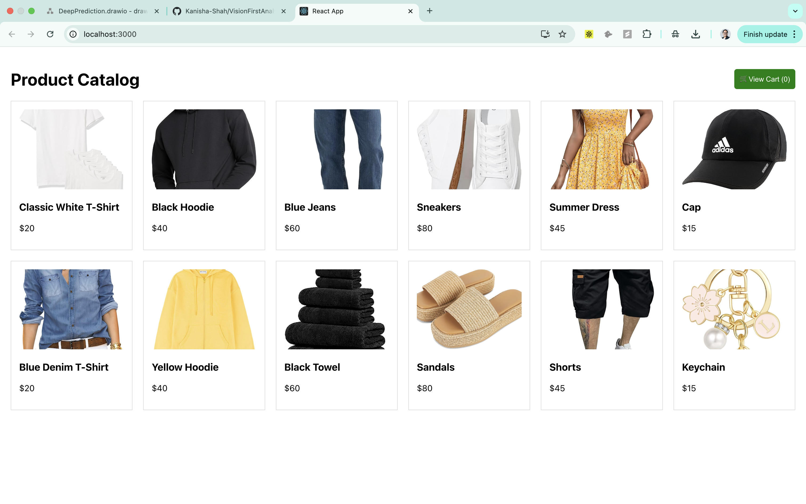
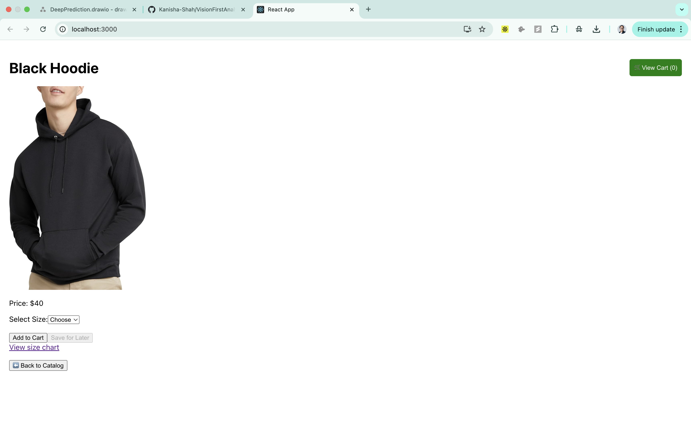
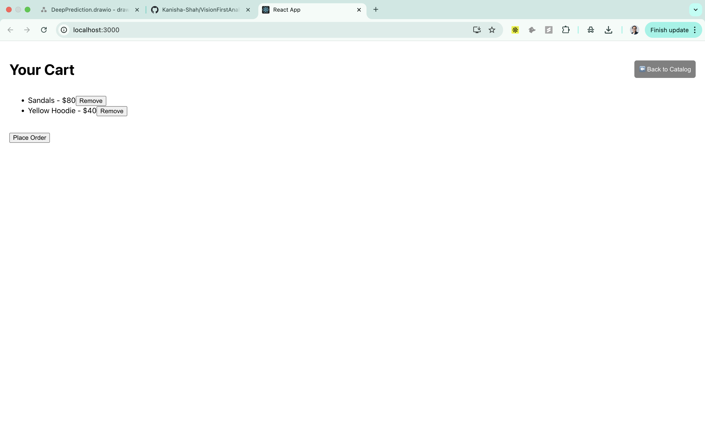
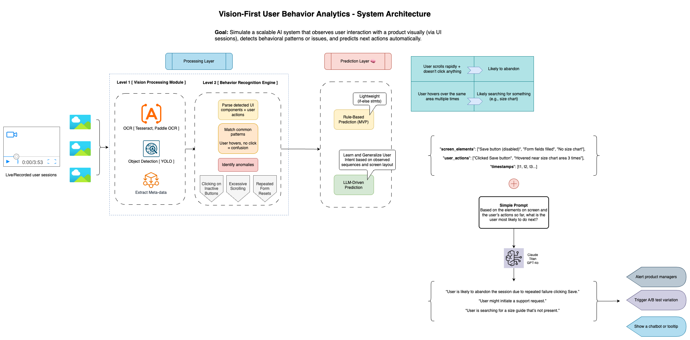
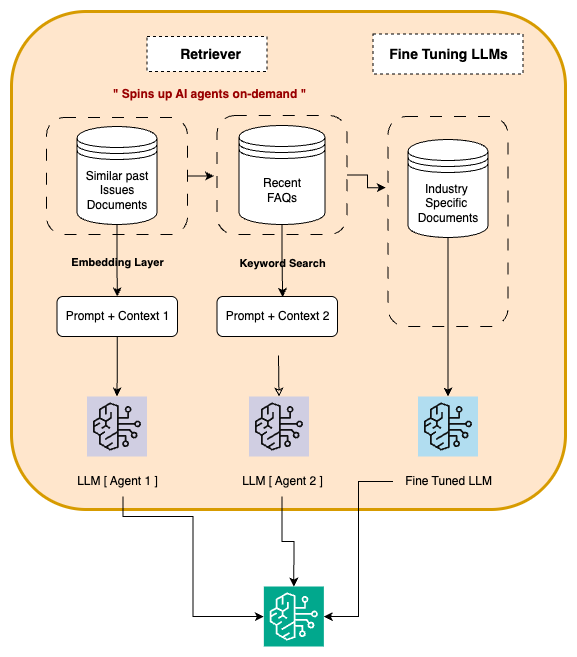

# Vision-First Behavioral Analytics Prototype

This project is a full-stack implementation of a **Vision-First Analytics System** designed to capture and interpret user behavior on a live website. Inspired by the mission of DeepPrediction, this system watches users' actions and visual context in real time to predict their intent, detect confusion, and suggest UI improvements using LLMs.

---

## 📌 Project Intent

Traditional analytics tools focus only on clicks and events. Our vision-first approach combines:

* **DOM-level behavioral tracking** (cursor, hover, DOM snapshot)
* **Visual context awareness** (live screenshot + object detection + OCR)
* **Rule-based and LLM-based prediction**

to enable high-fidelity, real-time UX diagnostics.

---

## 🖥️ Frontend

Built with **React** and **plain JS trackers**, the frontend simulates a product catalog UI. It includes:

### Key Files:

* `/src/App.js`: Main product interface with cart, product details, and dynamic views.
* `/public/cursorTracker.js`: Tracks:

  * Mouse movement
  * Hovered elements
  * DOM structure and text
  * Sends behavioral events to `/track`
* `/src/ScreenShotTracker/ScreenshotTracker.js`: Uses `html2canvas` to:

  * Capture full-page screenshots every 5s
  * POSTs screenshots to `/vision/upload`
* `/public/index.html`: Mounts trackers and injects required scripts.

### Frontend Behavior:

* Sends tracking data to backend every second.
* Flushes session on inactivity or via a "Flush Now" debug button.
* Live LLM-based insights shown in floating overlay.






---

## ⚙️ Backend (FastAPI)

The backend handles:

* Behavioral logging
* Screenshot ingestion
* Vision analysis
* Session summarization
* Rule-based and LLM-based UX inference

### Key Endpoints:

* `POST /track`: Receives cursor/hover logs per session
* `POST /vision/upload`: Receives base64 screenshot, runs YOLO+OCR
* `GET /flush`: Auto-summarizes inactive sessions
* `GET /flush/{session_id}`: Force flush a session

### Key Modules:

* `tracker_api.py`: Manages sessions and summarizes logs
* `vision_capture.py`: Accepts screenshots and merges visual analysis
* `vision_utils.py`: Performs:

  * YOLOv8 object detection on UI elements
  * Tesseract OCR to extract visible text
* `rule_engine.py`: Simple heuristic-based intent predictor
* `llm_utils.py`: Formats input and calls OpenAI GPT model to generate UX insights

---

## 🧠 Example Output

Upon session flush, you get:

* Structured UX summary (screen elements, actions, anomalies)
* Rule-based prediction (e.g., "User likely frustrated")
* LLM prediction (e.g., "User may be looking for a size chart that isn't present")

Logs are written to `session_logs.txt`.

### Example Session LLM output
```
"1. The user appears to be browsing through the product catalog, viewing different items such as a classic white t-shirt, a black hoodie, blue jeans, sneakers and a keychain. They are likely interested in these items and are considering purchasing them, as indicated by their actions of hovering over the item details and 'Add to Cart' buttons. The user also seems to be trying to view the size chart for the items, possibly to determine their appropriate size before purchase."
```
---

## 🧱 System Design

The system is structured around a shared `session_id`, allowing:

* Seamless merging of behavioral + visual data
* Modular scaling of trackers and analyzers
* Clear separation of concerns across capture, analysis, and inference layers





---

## ✅ To Run

1. `npm install` in React app
2. `npm start` to run frontend
3. Set OpenAI key in `.env`
4. `uvicorn main:app --reload` in backend

---

## ✨ Future Enhancements

* Real-time alerting (e.g., show tooltip when user is stuck)
* Model fine-tuning with RICO dataset for UI-specific object detection
* Session replay with heatmaps and cursor trails
* Integration with product team dashboards

---

This prototype demonstrates the feasibility and power of combining vision and behavior for predictive product intelligence. Use it as a foundation to build next-gen analytics systems that actually understand your users.
